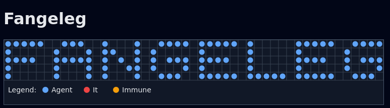

# Fangeleg



Fangeleg is a small simulator for an agent-based model where agents play the game of Tag, called "fangeleg" in Danish.

Agents are simulated as autonomous entities that move around a 2D grid and tag each other. At each step of the simulation, agents can move, tag, or remain stationary. Agent behavior is defined via  trait, which allows for custom agent implementations.

The project also includes a web-based visualization of the simulation running in WebAssembly and an API for defining custom agent behaviors using JavaScript.

## Usage
`just run` to build the project and serve it locally.
Explore `justfile` for more commands.

Unit tests exist for simulator logic like agent movement and tagging. Run them with `cargo test`.

## Requirements

With Nix flakes run:
```sh
nix develop
```

If using direnv with Nix flakes run:
```sh
direnv allow
```

Otherwise you need
- Rust toolchain (e.g. via `rustup`) with support for the `wasm32-unknown-unknown` target
- `wasm-bindgen` CLI v0.2.108
- `miniserve`
- `just` CLI (for convenience)
